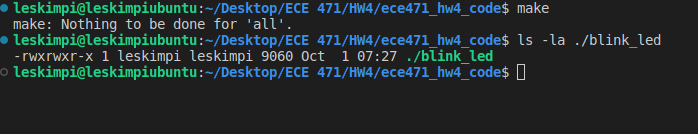
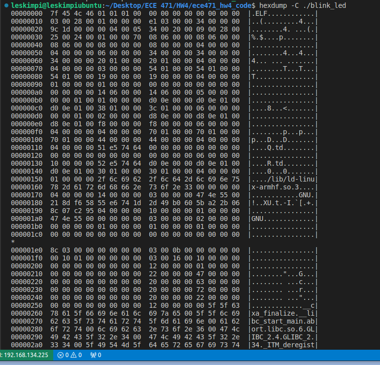
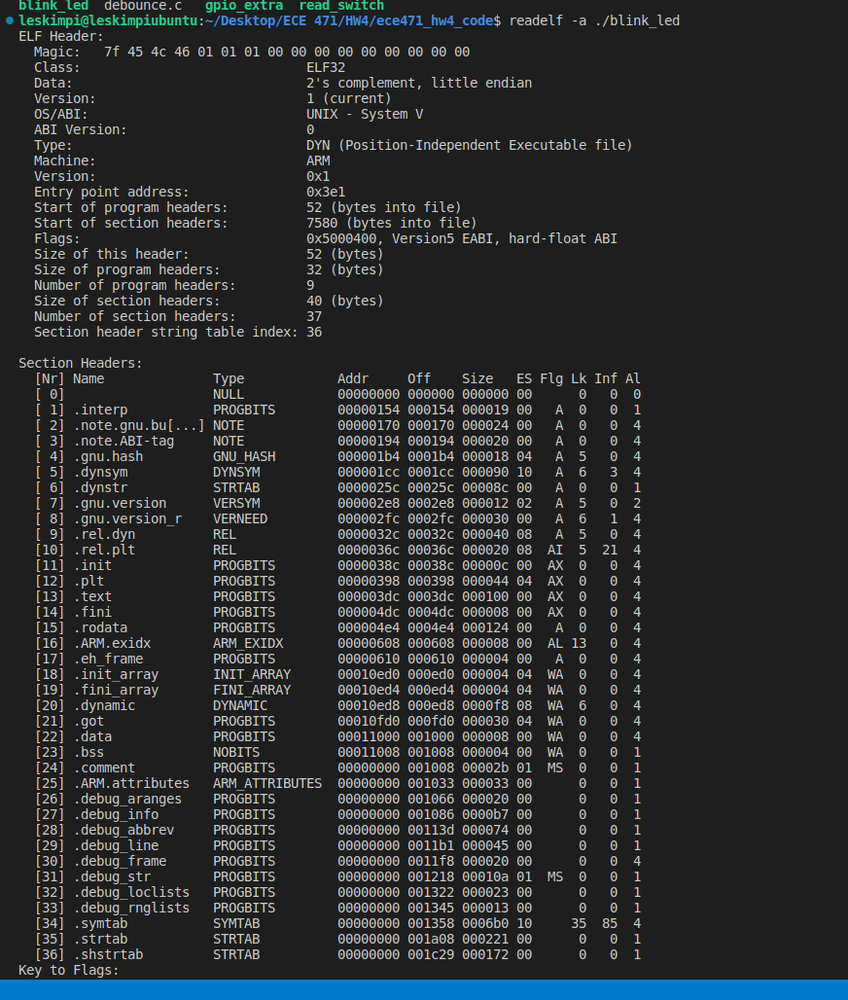
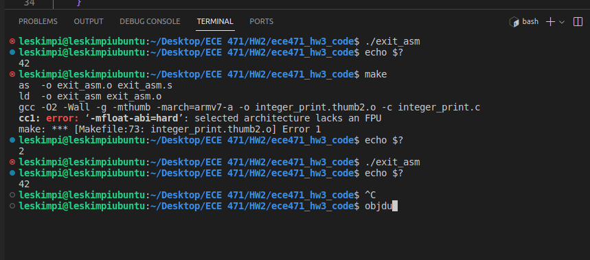
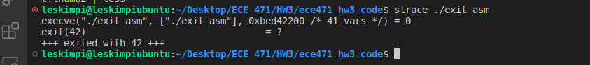
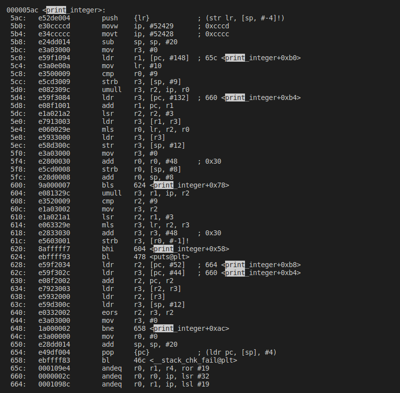
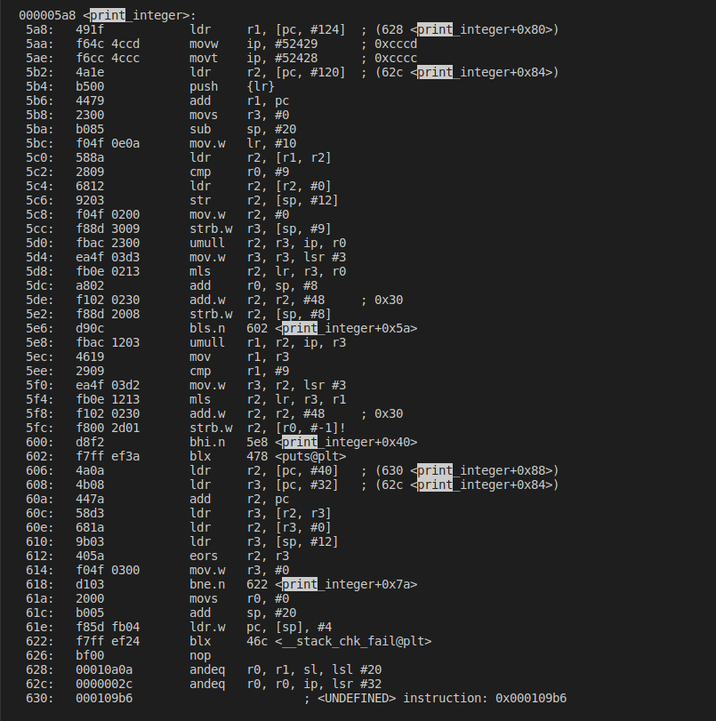

# Friday 15th Sept

- `sudo shutdown -h` now(shut down immediately)


### Coding Style
+ C has no rules
+ IOCCC 

### Naming Things
- count_active_users()
- `Camel casing` CountActiveUsers()
- u32iIndex - Hungarian notation

### Linux Kernel 
- only one exit to a function

```c
    int func() {
        if(err) goto label; 
    }

```
### How Executables are Made

+ Compiler 
        takes the source (c)   ------> takes it to assembly language
        `gcc -s`
+ Assembler
        assembly(.s) ------> object files
        `gas`,`as`
+ Linker
        objectfiles(.o, .obj) ------> executable
        `ld`, `gold`

### Apllication Binary Interface
- ABI
    - rules your code needs to follow to talk to other code + libraries
    - A software agreement

#### ARM32 C/userspace
r = Registers

r0-r3   ~    First 4 arguments in function(`caller` saved)
r0-r1    ~   return values
r4-r11    ~  general purpose (`callee` saved)
r12-r15   ~~ (stack, LR, PC)

### Kernel ABI
+ OABI - old/original [arm]
+ EABI - new/embedded [armel]
+ hard floating point [armhf]   <== used by `Raspbery Pi OS`

##### armhf
+ system call
+ system call number r7
+ argument           r0-r6
+ return value        r0

## Homework 3

#### Code Density
+ How small can your code can be
+ Still important in embedded systems

#### Instruction Set Architecture
- ARM32     [ 4 byte || 32-bit ]
- THUMB     [ 16-bit ]
- THUMB-2   4 or 2 bytes
- AARCH64 (arm64) 
        mostly different


# Monday 18th Sept


<!-- ![] -->

```s
# equ SYSCALL_EXIT,       1


        .global_start
_start:

        #======================
        # Exit
        #======================
exit:  

@ didnt write everything


```

### Codes run on Terminal for hello_world file

Getting the size `ls la <file>`

`make clean`

`readelf -a <code> | less`

`objdump --disassemble-all <file>`

`strace <file>`


- Write System Call Arguments: 
               - fd
               - pointer to data 
               - length


```s
.equ SYSCALL_EXIT,       1
.equ SYSCALL_WRITE,      4

.equ STDOUT,             1


        .global_start
_start:
        mov     r0, #STDOUT          /* stdout */
        ldr     r1, =hello
        mov     r2, #13              @ length
        mov     r7, #SYSCALL_WRITE
        swi     0x0


        #===============
        #Exit
        #==============
exit:
        mov     r0, #5
        mov     r7, #SYSCALL_EXIT       @ put exit syscall number in register 7 (r7)
        swi     0x0                     @ put exit code

```


`man write`


### Debbuger

`gdb <code>`    ---- gdb debugger

`(gdb) info regis `

`disassem`

`stepi`  ---- go one step


## Back to C CODES

#### Printing an Integer

```c

int x;
printf("%d", x);

//  x == 1234 

// You have to divide by 10 and store it to the [||||]

```s

Dividing: --

10|1234__R4
10|123__R4
10|12__R3
10|1__R2
  |0

Store [1|2|3|4|o]

```

// Read on ASCII Characters + UNICODE


```


# Wednesday 27th Sept.  

```s
+ exit in assembly 

ABI - r0 is first argument
        exit (42),


0x 10400
gcc 10
gcc 12

0x500
ARM32 ~~ 112 bytes
Thumb2 ~~ 88 bytes

```

# Monday 2nd October

#### Reserved Addreses

 7 bit address 0 ..... 127

 0

        reserved
 8

 78
        78..7C --10-bit addreses 


 7F 

#### Firmware

+ Code burned / flashed into device
+ Often controls low-level operation of devices

#### Boot Firware

+ Starts from scratch
+ Gets your system running
+ Kernel people
        + antagonistic relationship with firmware
  

#### Desktop x86
BIOS
UEFI --- Unified Extensible Firware Interface

#### Bootloader 

+ Code just smart enough to load the OS
+ Not many resources stay simple

#### Pi Booting
+ Unusual --- GPU (graphics card) --handles boot
+ Small amount of firmware'
+ Arm chip brought up, but asleep
+ GPU (videocord) loads bootloader


#### Boot
+ Videocore reads bootcode bin
    + /boot partition(FAT)
    + Own OS, RTOS [Real time OS]
    + ThreadX

- ThreadX gets rest of system going
- SDRAM, loads 


#### PI4
Reads initila file from SPI eeprom
Fancier Boot methods
        nexboot
        usb stick
        PCIe bus


#### ARM System Booting
+ UBoot
+ ARM chip boots everything
+ MCO - First stage
+ uBoot - second stge


#### Partitions
+ logically split a storage device into multiple sections
[boot | swap | // | /home]
/dev/sda1   C1
/dev/sda2   D1
            E1

#### FAT
File Allocation Table
        simple filesystem
        1980s
        64l RAM
portable
Filesystem often used
        for/boot
        simple


### IMPORTANT COMMANDS

`ls -la ./<filename>` - Checks the size of the file




`hexdump -C <./<filename>` -See the raw binary (well, hex) values



`readelf -a <./filename>` - Look at the elf executable layout



`objdump ---disassemble-all <./filename>` - See the machine code we generated
-Error encountered while running make on HW3


`strace <./filename>` - Trace the system call as the happen


###### HW3 Images

+ Dissasembly of `integer_print`


+ Dissasembly of `integer_print_thumb2`



### IMPORTANT COMMANDS


