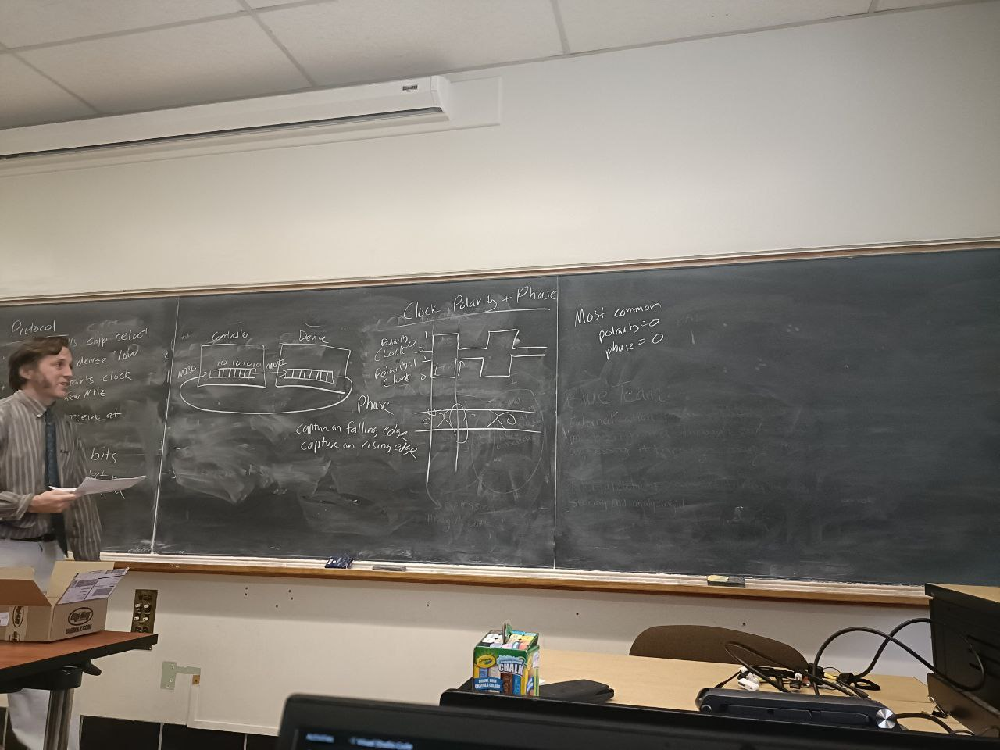
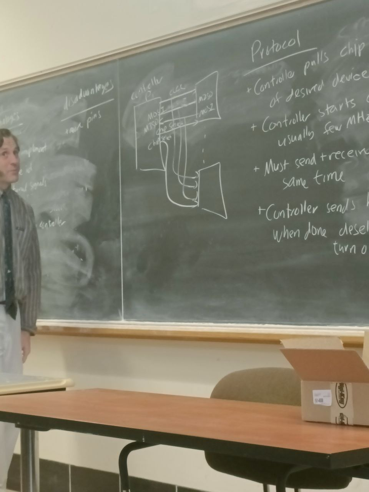
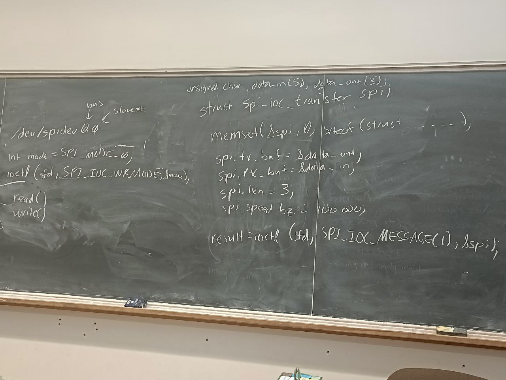
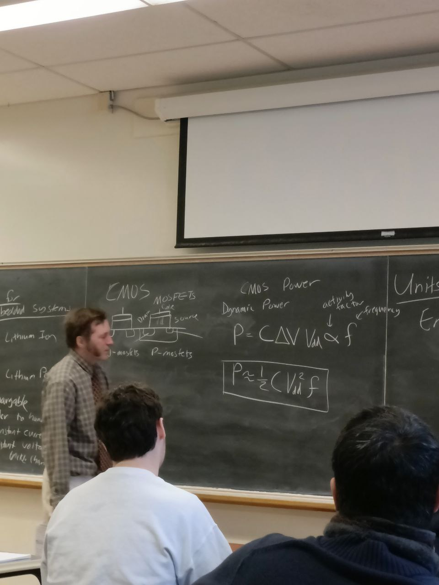
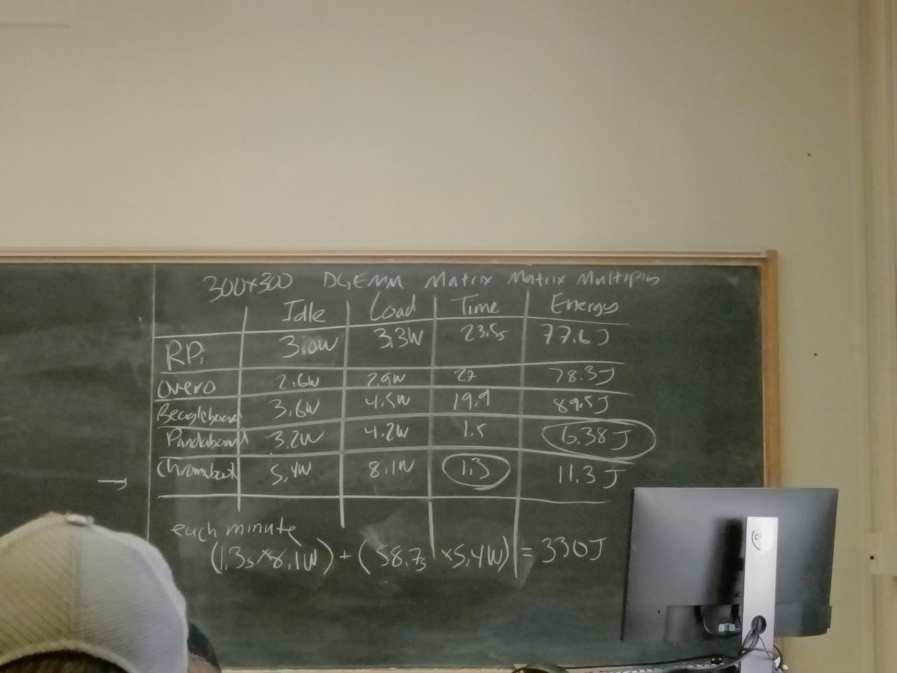

<!-- Friday 15th Sept -->

- `sudo shutdown -h` now(shut down immediately)


### Coding Style
+ C has no rules
+ IOCCC 

### Naming Things
- count_active_users()
- `Camel casing` CountActiveUsers()
- u32iIndex - Hungarian notation

### Linux Kernel 
- only one exit to a function

```c
    int func() {
        if(err) goto label; 
    }

```
### How Executables are Made

+ Compiler 
        takes the source (c)   ------> takes it to assembly language
        `gcc -s`
+ Assembler
        assembly(.s) ------> object files
        `gas`,`as`
+ Linker
        objectfiles(.o, .obj) ------> executable
        `ld`, `gold`

### Apllication Binary Interface
- ABI
    - rules your code needs to follow to talk to other code + libraries
    - A software agreement

#### ARM32 C/userspace
r = Registers

r0-r3   ~    First 4 arguments in function(`caller` saved)
r0-r1    ~   return values
r4-r11    ~  general purpose (`callee` saved)
r12-r15   ~~ (stack, LR, PC)

### Kernel ABI
+ OABI - old/original [arm]
+ EABI - new/embedded [armel]
+ hard floating point [armhf]   <== used by `Raspbery Pi OS`

##### armhf
+ system call
+ system call number r7
+ argument           r0-r6
+ return value        r0

## Homework 3

#### Code Density
+ How small can your code can be
+ Still important in embedded systems

#### Instruction Set Architecture
- ARM32     [ 4 byte || 32-bit ]
- THUMB     [ 16-bit ]
- THUMB-2   4 or 2 bytes
- AARCH64 (arm64) 
        mostly different


<!-- Monday 18th Sept -->

<!-- ![] -->

```s
# equ SYSCALL_EXIT,       1


        .global_start
_start:

        #======================
        # Exit
        #======================
exit:  

@ didnt write everything


```

### Codes run on Terminal for hello_world file

Getting the size `ls la <file>`

`make clean`

`readelf -a <code> | less`

`objdump --disassemble-all <file>`

`strace <file>`


- Write System Call Arguments: 
               - fd
               - pointer to data 
               - length


```s
.equ SYSCALL_EXIT,       1
.equ SYSCALL_WRITE,      4

.equ STDOUT,             1


        .global_start
_start:
        mov     r0, #STDOUT          /* stdout */
        ldr     r1, =hello
        mov     r2, #13              @ length
        mov     r7, #SYSCALL_WRITE
        swi     0x0


        #===============
        #Exit
        #==============
exit:
        mov     r0, #5
        mov     r7, #SYSCALL_EXIT       @ put exit syscall number in register 7 (r7)
        swi     0x0                     @ put exit code

```


`man write`


### Debbuger

`gdb <code>`    ---- gdb debugger

`(gdb) info regis `

`disassem`

`stepi`  ---- go one step


## Back to C CODES

#### Printing an Integer

```c
int x;
printf("%d", x);


//  x == 1234 

// You have to divide by 10 and store it to the [||||]
/*

Dividing: --

10|1234__R4
10|123__R4
10|12__R3
10|1__R2
  |0

Store [1|2|3|4|o]

*/

// Read on ASCII Characters + UNICODE

```


# Wednesday 20th Sept

add r0,r1,r2
sub
mul


and     
orr
eur

        mov r0,#0
loop:
    :
    :
    :
    add  r0,r0,#1
    cmp  r0,#10
    lone loop

### Flags
z --- zero
v --- overflow
n --- negative
c --- carry


### Wierd ARM Things
Barrd Shift
        x=x*5;
        add r0,r0,r0,c5c #2


Addressing
        ldr r0, [r1]
        ldr r0, [r1, #20]
        ldr r0, [r1,r2]

ldr r1, [r2,r3, ]


<!-- Missed some stuff here -->

### Conditional Execution

```s
if(x==5){
        a+=2;
}else{
        b = b-2;
}

```

```s
cmp r1,#5
bne else
add r2,r2,#2
b done
else:
     sub r3,r3,#2
done:

```


```s
cmp r1,#5
addeq r2,r2,#2
subne r3,r3,#2

# explanation :-

[cond|opcode| |Rn]  [Rd| | |Rm]


[ ]


THUMB
        + remove conditional
        + acces r0, r7
        + only two arguments
        + no barrel shift

```

```s
THUMB -2   #noice 
        + Full new encoding at machine level language
        + Instructions can be 32 or 16 bit
          removed instructions, rsc
          barrel shift limited
          add,w  add,n
          conditional exec limited
```

```s
.thumb 
        it cc
        addcc r1,r2

        itece cc
        addcc 
        addcs

```


### AARCH64      ARM64 **** 

  + 32 bit fixed encoding
  + 32 64-bit General Purpose registers
        x0  .... x31
        x0  .... x7 args
        x8  .... x18 temp
        x19 .... x28 callee
        x29 frame pointer
        x30 link reg
        x31 stack pointer, or Zero register


<!-- Monday 2nd October -->

#### Reserved Addreses

 7 bit address 0 ..... 127

 0

        reserved
 8

 78
        78..7C --10-bit addreses 


 7F 

#### Firmware

+ Code burned / flashed into device
+ Often controls low-level operation of devices

#### Boot Firware

+ Starts from scratch
+ Gets your system running
+ Kernel people
        + antagonistic relationship with firmware
  

#### Desktop x86
BIOS
UEFI --- Unified Extensible Firware Interface


#### Bootloader 

+ Code just smart enough to load the OS
+ Not many resources stay simple

#### Pi Booting
+ Unusual --- GPU (graphics card) --handles boot
+ Small amount of firmware'
+ Arm chip brought up, but asleep
+ GPU (videocord) loads bootloader


#### Boot
+ Videocore reads bootcode bin
    + /boot partition(FAT)
    + Own OS, RTOS [Real time OS]
    + ThreadX

- ThreadX gets rest of system going
- SDRAM, loads 


#### PI4
Reads initila file from SPI eeprom
Fancier Boot methods
        nexboot
        usb stick
        PCIe bus


#### ARM System Booting
+ UBoot
+ ARM chip boots everything
+ MCO - First stage
+ uBoot - second stge


#### Partitions
+ logically split a storage device into multiple sections
[boot | swap | // | /home]
/dev/sda1   C1
/dev/sda2   D1
            E1

#### FAT
File Allocation Table
        simple filesystem
        1980s
        64l RAM
portable
Filesystem often used
        for/boot
        simple


#### Booting options
+ Floppy Disk
+ Hard Drve(SSD)
+ USB-Stick
+ SD-Card
+ CD-ROM / DVD
+ Network

#### Enumerating Hardware
+ Hard code
+ Standard 
      + IBM PC
      + VGA = A000; 0000
+ Enumarate, Search
      + USB
      + PCIe
+ Ideally Firmware tells you
      + x86 --- ACPI
      + ARM
        + Device Tree, Binary blob, Open standard
        + ICCy, value
        + Memory; 1GB

<!--  Wednesday 4th October -->

### HW 4

- error checking
        - print error message
        - exit
  
  `usleep()` --- can enter a low power state
  `uname` 
  linux pi 4,14.1 #122 smp Tue Jan armvl  WU/linux
                                   arch64 


### Disk Spacde
df -h == human readable     512 byte chunks


### Real Time Constraints
What are real time constraints? :-
        -> Time Deadlines the system needs to respond in
        -> Goal not perfomance, but guaranteed response time
        -> Deadlines often are short
                Milliseconds to microseconds
        

### Types of Real Time

##### Hard 
        - miss deadlines, total failure of system
        - people could die if miss deadlines

##### Firm
        - result no longer useful after deadline but occasional misses might be ok 
        - video decoding

##### Soft
        - results you get are gradually less useful after deadline passes


### Who uses Real Time

+ medical devices
+ vehicles
    + airplanes, rockets, cars
+ testing equipment/measurements
+ industrial / SCADA
    + power plants
+ music
+ high speed trading 


<!-- Friday 6th October -->

### Midterm
- In class
- Closed book / notes
- One page of nots
- Mostly short answers
- No coding, might give you code similar to HW task quiz


### Topics
- Characteristics of Embedded Systems
+ Benefits of an OS
+ Downside of an OS
+ Busses
        GPIO
        I2C - limitations
                length of cable
                speed
+ Code density
        Having small code still important
+ No assembly coding
+ THUMB-2


### Atari VCS 2600
1977
        6507 processor
        6502 hacked off pins
                12 address lines
                4K ROM
                128 bytes of RAM'
                memmory mapped I/O
                No firmware, jumps to reset vector


### Software Jitter
+ Interupts
+ Operating system
+ Garbage collection


### Latency
 


<!-- Monday 16th October -->

### Scheduler Strategies

Program ready to run go into a queue
+ Simple ---> (IN-Order) order they arrived
+ Static ----> (RMS) Rate Monotonic Scheduling
                shortest task first
+ Dynamic  ----> (EDF) Earlies Deadline First

``A``; deadline finishes in `10s` , takes `4s`
``B``; deadline finishes in `3s` , takes `2s`
``C``; deadline finishes in `5s` , takes `1s`

Example of scheduling strategies :-
```
|___________|012345678910|  ------> time they take
|___________|____________|
|In Order   |AAAABBC_____|
|RMS        |CBBAAAA_____|
|EDF        |BBCAAAA_____|
|___________|____________|
```
+ Priority Based Schduling
        - Multiple tasks, assign priority
        - Higest priority task pre-empt

        B -> highest
        C -> medium
        A -> lowest

```
 |_______________________|       
0|   `B  `               |
 |_______________________|
1|         `C`           |
 |_______________________|
2| `A`   `A`    `A`  `A` |  
 |_______________________| 

```

+ Without an OS

```c

main(){
   while(1){
        do_task(); //read sensor
        do_task(); //react to sensor
         do_task(); //GUI
   }
}
```

+ Real Time OS
        - can provide `multi-tasking`
        - can provide `prioriity based scheduling`
        - can provide `interupt handling`
        - `locking/memory alllocation`

+ Hard RTOS
        -
+ Vxwoncs
Has:-
        - priorities
                0....255
        - task is done
                `yield()`
        -all the same
                `round robin`
        - `ABC` `ABC`
+FreeRTOS
Has:-
        - STM32, Pi Pico
        - Code `9K`
        - Timers
        - Interrupts
        - Locks
        - Priority Based Scheduling

+ General Purpose OSes
- generally cant do realtime
        - Often have priority based
        - Linux "nice" 

+ Posix Real Time
        -Priorities:
        ```
                                  |highest|  lowest|    
                nice      |  -20  |...19   |
                real time |  0    |...99   |

        ```
+ Real Time Linux
- rt-linux
        - optimize interrupt handler
        - changed locks to be pre-emptible
        - make all of kernel pre-emptible

<!-- Friday 20th October -->


### Scheduler

- Picks what program runs next
- Complex :-
  - O(N)
  - O(1)
  - O(log N) -used now "completely fair scheduler"
=======
### SPI (SErial Pheripheral Interface Bus)


- Synchronous Full-Duplex Serial Bus

`Serial` - One bit at a time
`Synchronous` - Clock wire
`Full-duplex` - Send + receive at same time
                        + LCD Display
                        + SD cards
                        + LED Strips
                        + JTAC debugging
                        + A/D converter

- Hardware

controller multiple devices
        <!-- Image here -->

        

        - 4 wire bus (2 power, 2 ground)
        - `SCCK` Serial Clock
        - `MOSI` Master OUT Slave IN
        - `MISO` Master IN Slave OUT
        - `CSO` Chip Select


<!-- Wednesday 15th Notes -->

#### HW8
+ error check


+ parasite mode 1-wire


#### Shell Script

#!/bin/sh
 ---> she bang

 /bin/bash
 /bin/csh
 /bin/zsh
 /bin/fish

 ##### Midtern
 + Allowed 1 sheet notes
 -> Cover mostly stuff since last midterm
 -> Booting on Pi ((GPU does the booting))
 -> Firmware
 -> Real time (definition, hard , soft, firm)
 -> i2C [more rules] / SPI (high bandwidth) (fewer rules no arbitration no error handling)
  ./ 1-wire 
-> Security / Code correctness
-> avoid untrusted input
-> Codding practices
        comment code
        avoid undefined behaviour
        have a good spec
        test your code


##### Ethics in Software Engineering
+ Privacy
+ Data logging
+ Selling personal info
+ Dark patterns


<!-- Wednesday 15th Notes -->
=======
- Protocol

        = Controller pulls chip select of desired device low     
        = Controller starts clock usually few MHz      
        = Must send + receive at same time
        = Controller sends bits when done deselect + turn off clock
        =
        
- Clock Polarity + Phase


                <!-- Image of how it works here -->

                

                * Most common 
                        polarity = 0
                        phase = 0

                * Interupts are posible Pi doesn't support it

- Advantages

        - Fast
        - Simple to implement
        - No unique id
        - Unidirectional signals
        - Low power
        - Clock provided by controller

- Disadvantages
        - More pins
        - Short distances
        - No flow control
        - No error reporting
        - No standard

### Doing Homework Setup on PI

        ```c
Pin 23 - `SCCK`
Pin 19 -`MOSI `
Pin 21 -`MISO `
Pin 24 - `CEO`
Pin 26 - `CEI`
                        ```c
                        /dev/spider(bus(pin), slave(pin))

                        int mode = SPI_MODE_0;
                        'ioctl(fd, SPI_IOC_WRMODE; $mode) 


                        
                        ```

        ```
                <!-- Image of seting upp the SPI -->

                

- MCP 3008
        8 port 10-bit SPI
                A/D converter
        
        Send 3 bytes 
                
        ```c
        Start bit_________________________________
        |xxxxx| |xxxx|  |xxxx| |x098| |7654| |3201|
        |_________________________________________|

        ___________________________________________
        |xxxxx| |xxxx|  |xxxx| |x098| |7654| |3201|
        |_________________________________________|
        <!-- geting `7654 3201` to position 1 -->
        
        int x = (buffer(1) << 8);
        deg_Farenheight = ((deg_C)* 9/5 ) + 32;
        printf("%lf"/n)
        ```

        

<!-- Friday 20th October -->


<!-- # Monday 23rd October -->

```c
 memset()
        <!-- initializing to zero -->

```


<!-- # Monday 23rd October -->


<!-- Friday 3rd November -->

Midterm on 17th 


### HW9
         measuring temp
         result on a display

         either 1-wire / SPI
         modular code
         multiple C files
         self contained code
         working groups
         git


         ```c
        // # include "temp.h" file

         double get_temperature(void) {
                // code here
         }
         
        //  set the display and geting temp seperately

         ```


        ```c
        double t;

        t = 65.2;

        // Using division to display the results
        hundreds = t/100;
        remainder = t % 100;
        tens = remainder / 10;


        sprintf(str, "%lf, t)
        
        
        ```

### Computer Security

##### Types of Security Issues

        + Crash
        + Demand of Service (DOS)
        + User account compromise
        + Root account compromise  (rootkit)
        + Remote root compromise

##### Information Leakage/ Side Channel Attacks

        + Side channel
                Leak info
                Radio waves
                Power supply
        + Timing
                Different paths through
                Code takes different time

        + Meltdown/ Spectre
                modern 0o0 processors
                speculative execution

        + Deceptive code
                Typo squatting
                Javascript / npm
                Sneak code into Linux kernel
                Uot Minnesotta tried to sneak code in
                Source code unicode

        + Finding Bugs
                Crashes
                Source code inspection
                Watching lists/ bug reports
                Static checker
                Dynamic checkers/ valgrind
                Festing
                Fuzzing
                <!-- Social Engineering -->
                       
                
<!-- Friday 3rd November -->


<!-- Monday 6th November -->


##### Social Engineering
        + Talking your way in
        + Phishing attacks
        + "The art of deception"

##### Case Studies
        - 2010 IEEE SoSP
                Fuzzed a car (CANBUS) - control brakes
                                      - heating / cooling
                                      - windows / locks
                                      - anti lock
                                      - cruise control
                                      - pre-crash detectiomn
                                      - instrument panel
                                      - stop engine

        - Stuxnet
                SCADA (Supervisory Control + Data Acquisition) 
                                        - Via internet plus USB key
                                        - Four zero-day vulnebility
                                        - Was to activate on a specific Siemens SCADA


        Software Bugs
                + Not all issues are security
                + Bad code/ accidental
                + User interface

        Automotive
                + Bugs in Toyota firmware
                        (engine accelerated without stopping)
                        VIN
                + Airplanes
                        AA Flight 965
                                (waypoint R) --computer picked the wrong waypoint and crashed
                        AirFrance 447
                + Military
                        Patriot Missile
                        Yorktown Smart Ship (1997) ---Windows NT
                        


<!-- Monday 6th November -->


<!-- Wednesday 8th November -->
Where security is affected:-
                + Financial
                
                + Power
                   2003 Blackout
                   race condition in server

        
Code Safety Standards
        + Aironics
        + Industrial
        + Railway 
        + Nuclear
        + Medical
        + Automotive

                1. Aviation
                        D0-178B/DO-17bC

                        Catastrophic
                        Hazardous
                        Major
                        Minor(inconvinience)

                2. Automotive
                        ISO 26262

                        - definitions
                        - management
                        - safety life cycle
                        - processes
                        - Severity
                                S0 -No injuries
                                S3 -Not survivable
                        - Exposure
                                E0 - Not likely
                                E4 - Highly likely

                3. Medical
                        IEC 62304

                        - Avoid using software of unknown pedigree

                        Class A

                        Class C

### Writing Good Code
 - Various Books
 - Comment your code
 - Formatting
 - Exact variable types
        int32_t            int
- Avoid undefined behavior
- Tools to enforce

### MISRA -  C
 Motor Industry Software Reliability Asssociation

 Guidlines:-
        Mandatory
        Required
        Advisory

        use int32_t
        avoid functions that can fail -- `malloc()`
        maintainable coding styles

Compliance:- 
        All mandatory must follow
        Required rules you can break formal writeup

        MISRA 2012
                143 rules
                16 directives

Documentation:
        Comment code
        Auto-generate docs from code commments

Good code example
        `Space Shuttle`
                - computers were good
                - lots of testing
                - only 3 bugs,,,.....,,,


<!-- Wednesday 8th November -->


<!-- Monday 13th Novemeber-->

#### Midterm

primarily material since the last midterm

- Booting on Pi / Firmware
- Realtime
        definition
        hard/soft/firm
- i2c/SPI/1-wire (differences and importance)
- Security
- Coding practices
- 1 page notes

#### HW7

```c
memset(&spi, 0, sizeof(struct spi_ioc_transfer));


/dev/null   ---> throws everything away

program > /dev/null
stdout
stderr

/dev/full    ----> always looks full
/dev/zero    ----> 
/dev/random  ----> gives random numbers(good for encryption)

CPU provides the randomnes
        Linux mixes in I/O

pseudo random number generation
        have to seed it to start


```

 i2C / SPI

 WII Nunchuck
        secret handshake
        0xf0/0x55/0xfb/0x00
older   0x40/0x00

send    0x00
        joy-x
        joy-y
          acc x
          acc y
          acc z

Keyboard
        PS/2 serial bus
             returned keycodes
             microcontroller
        
        USB  keyboard
             OS abstracts
        
Digital Audio

        Audio --analog signal

        Digital - Analog converter
                  44kHz
                  wav file

          
<!-- Monday 20th November -->

##### Energy and Power

Power = Energy / Time

Power is `instantaneous`

###### Units
 Energy - Joules, kWh(3.6MJ)
        - Therm(105.5MJ)
        - 1 Ton TNY(4.26J)
        - eV(1.6x10^-19 J)
        - BTU(1055J)
Power   - Watts (J/s)
        - Horsepower(746W)
        - Tons of refrigiration(12,000BTU/h)

Baterries for Embedded Systems
* LiOn Lithium Ion
* Li-Po Lithium Polymer (rechargable)
* controller to handle recharging
        - constant current

###### CMOS

MOSFET
<!-- Diagram here -->

CMOS Power
Dynamic Power
P = C/_\ V Vdd & F
        & - activity factor

 

###### Static Power
Leakage current

Pstatic = IleakageVdd

###### Thermal
temperature closely related to power

___________|Idle___|Load___|Time___|Energy__
RPI        |3.0W   |3.3W   |23.5s  |77.6J
Overdo     |2.6    |
Beagleboard|       |
Pandaboard |       |
Chromebook |       |



Least Energy ---Pandaboard
Fastest  ---- Chromebook


<!-- Monday 20th November -->


<!-- Monday 13th Novemeber-->


